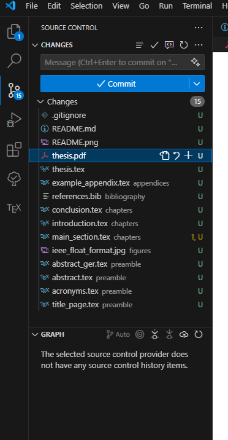
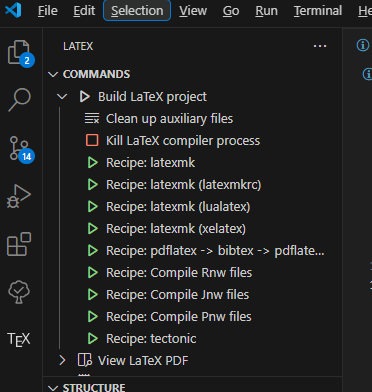
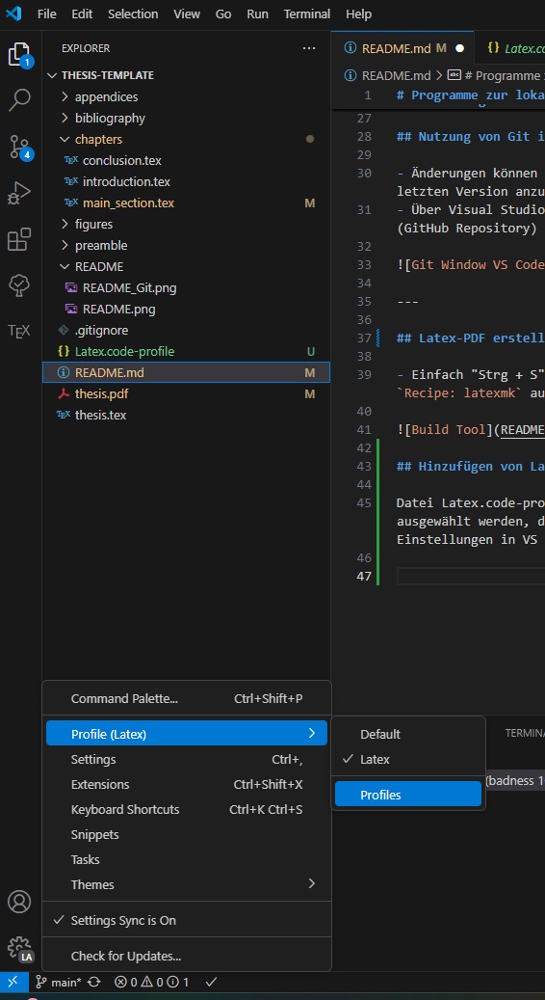

# Programme zur lokalen Ausführung

## Voraussetzungen

### Tex Live (LaTeX Distribution)
Der Download dauert ca. 1 Stunde und 10 Minuten.  
[Download Tex Live](https://www.tug.org/texlive/)

### Git (Versionsverwaltung)
[Download Git](https://git-scm.com/downloads)

### Visual Studio Code
[Download Visual Studio Code](https://code.visualstudio.com/download)

---

## Erklärung: Git + GitHub

GitHub ist eine Verwaltungsplattform (ursprünglich für Code), bietet aber auch nützliche Features für LaTeX.

1. Einen Account auf GitHub erstellen.
2. Auf Clone klicken unter https://github.com/KsslJan/Thesis-Template klicken, um das Verzeichnis abzuzweigen.
3. In einer Konsole im gewünschten Verzeichnis den Befehl ausführen:  
   `git clone <URL zu dem Repository>`

---

## Nutzung von Git in Visual Studio Code

- Änderungen können "committed" werden, um Unterschiede zur letzten Version anzuzeigen.
- Über Visual Studio Code können die Änderungen auf den Server (GitHub Repository) "gepusht" werden.

---

## Latex-PDF erstellen

- Einfach "Strg + S" drücken oder im TeX-Tab die Option `Recipe: latexmk` ausführen.

## Hinzufügen von LaTeX Profile in VS Code

Datei Latex.code-profile muss ggf in VS Code importiert und ausgewählt werden, damit sollten alle Extensions und Einstellungen in VS Code automatisch durchlaufen.

